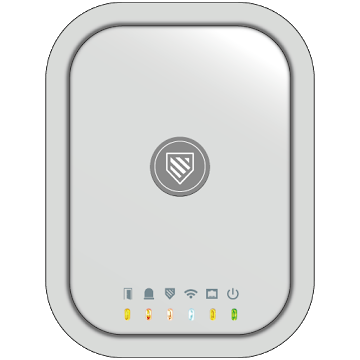
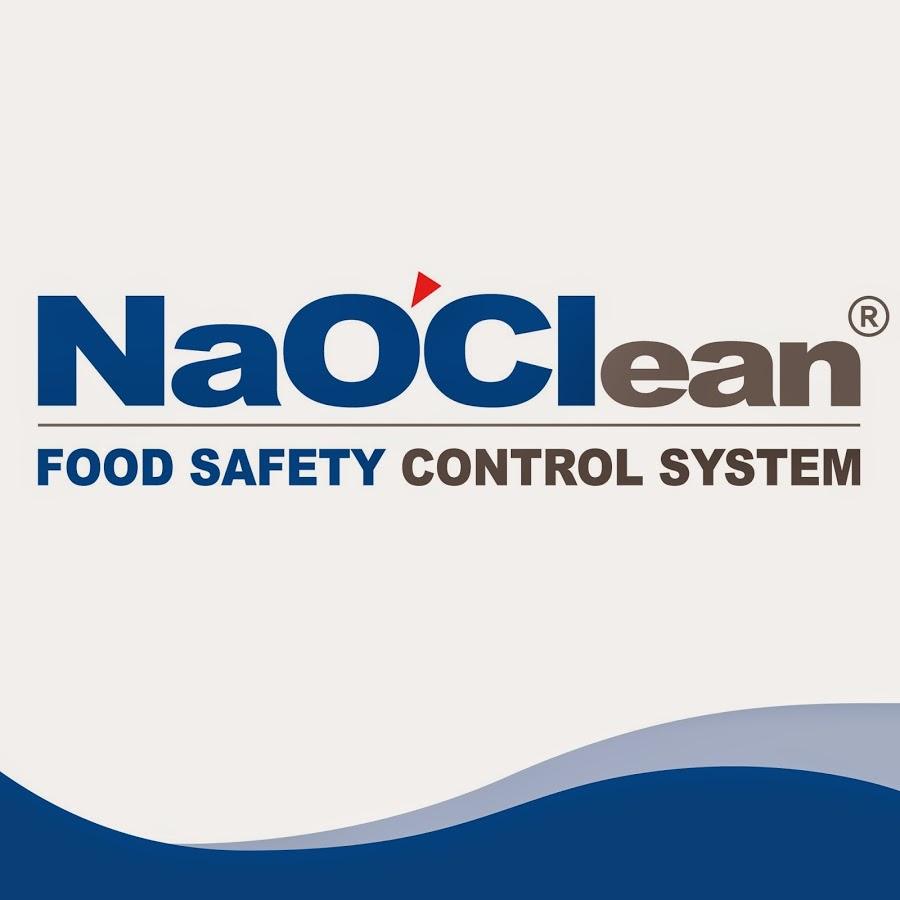
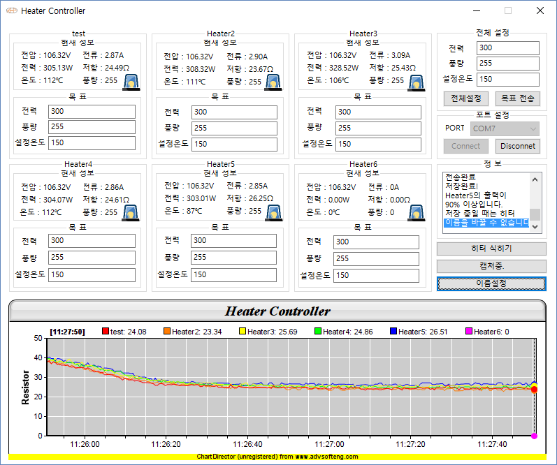
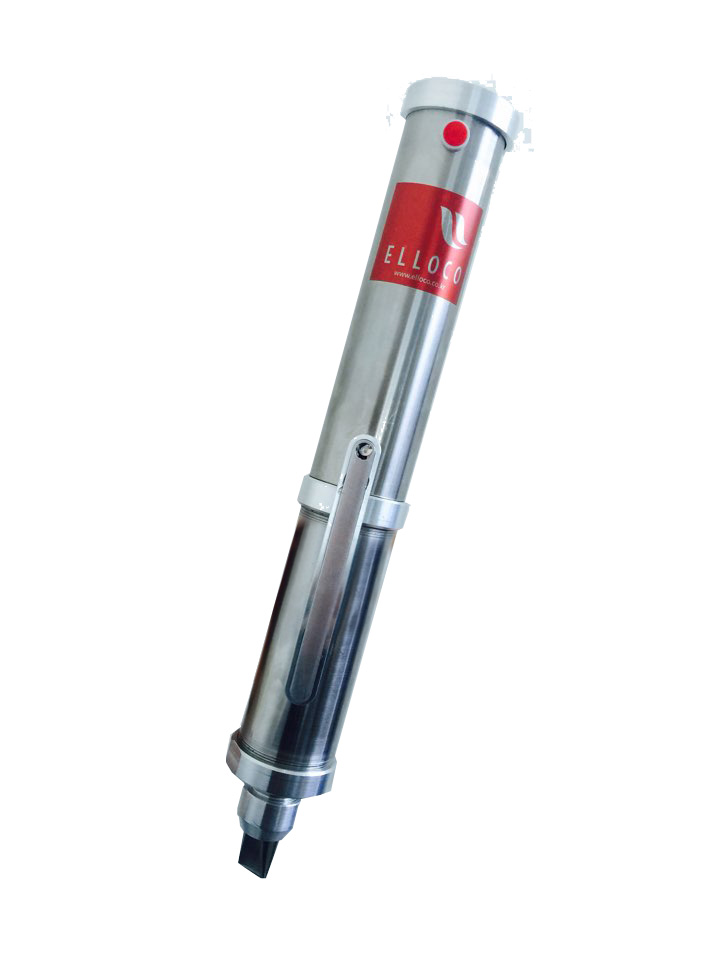
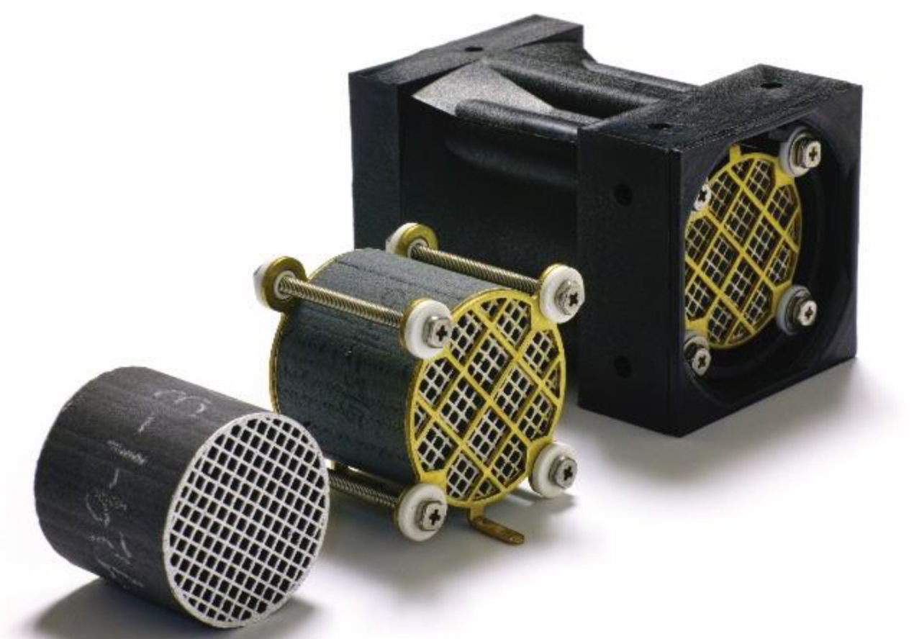
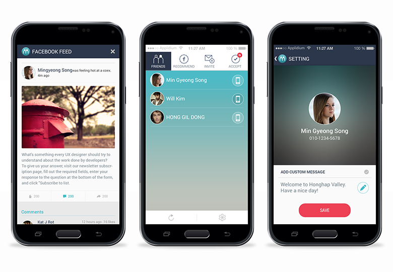

# 이력서

* 이름 : 이재성
* Email : fg9658@gmail.com
* Github : [github.com/RebirthLee](https://github.com/RebirthLee)
* 취미 : 게임, 카페코딩, 스터디, 세미나 참가.
* [자기소개서](./ABOUT_ME.md)

기술적 트렌드를 항시 체크하는 습관, 항상 코드에 대한 의심 더 나은 방법을 끊임 없이 생각하며,

## **Skill Stack**
### Backend 
- **Go**
  - **RESTful API** : Echo Framework를 이용하여 클라이언트에서 필요한 데이터를 위해 RESTful API 개발.
  - Socket Server : IoT 장비의 원격 및 신호 데이터 통신에 대한 TCP 소켓 프로그램 유지보수 및 추가 기능 개발.
- **Docker**
  - Go 애플리케이션 배포.
- Java
  - Tomcat : Spring Framework로 구축된 레거시 API 유지보수, 추가 기능에 대한 개발.

### Data Store
- **MariaDB(MySQL)**
  - **SQL** : API서버에서 필요한 쿼리문을 개발가능.
  - Event, Trigger, Stored Procedure
- **Redis**
  - 장비 접속 리스트 관리
  - 인증 값 저장(문자인증키, 계정 인증 Token Key).

### Frontend
- **Android**
  - **Java**, Kotlin : 추가기능 및 새로운 코드에 대한 것들은 코틀린으로 개발.
  - **NDK, JNI** : DVR회사에서 제공된 Shared Library를 가지고 실시간 영상 스트리밍에 대한 기능 개발.
    - C++ : JNI를 이용하여 클래스 인스턴스마다 Hashcode를 가지고 Map으로 관리.
  - Used Libraries
    - RxJava2
    - Dagger2
    - AAC(ViewModel, Room, LifeCycle)
    - Retrofit2
    - Timber
    - Glide
    - Picasso
    - Otto
    - Gson
    - Databinding
    - KotlinExtension
- **iOS**
  - **Swift**
  - Used Libraries
    - RxSwift
    - RxCocoa
    - RxAlamofire
- **ReactJS**
  - 훅스와 클래스를 섞어서 사용했으며 회사 내부용 툴을 위해 개발.

### Others
- Firmware
  - C
  - Atmega
  - Interrupt, Timer(PWM), ADC 
  - UART, modbus, SPI, 1-Wire Communication(WS2812B)
- Monitoring 
  - Firebase Crashlytics
  - Firebase Performance 
  - Firebase Analytics
- Communication
  - Slack
  - MS Teams
- Git Repository
  - Github
- Version Control
  - Git
  - GitFlow : 빡빡한 규칙보단 깃플로우의 모델링을 참고하여 브랜치를 나눠서 작업.

### Todo
- **Docker Compose**
- **Docker Swarm**
- **Kubernetes**

### Interest
- **오픈소스 기여**
- **AWS, 클라우드 인프라**
- **DevOps**
- **CI/CD**
- TensorFlow
- UI/UX Design

## 회사경력
|근무기간|회사명|업무|
|-|-|-|
|2018.6 ~ 재직중|[유비스마트](http://ubsmart.kr/)|Backend/DB, iOS, Android|
|2014.12 ~ 2016.6|[담덕글로벌](http://damduk.co.kr/)|Firmware, Android|
|2014.10 ~ 2014.12|[에이엔티홀딩스](http://www.ant-holdings.com/)|Android Developer(Intern)|

## 학력
|재학기간|구분|학교명(소재지)|전공|학점|
|-|-|-|-|-|
|2012.03 ~ 2015.02|졸업|안산공업고등학교|전문(실업)계 (컴퓨터과)|-|

## 자격/수상
|취득일/수상일|구분|자격/어학/수상명|발행처/기관/언어|합격/점수|
|-|-|-|-|-|
|2013.05|자격증/면허증|정보처리기능사|한국산업인력공단|최종합격|
|2014.05|자격증/면허증|정보기술자격(ITQ)한글엑셀 A등급|한국생산성본부(KPC)|최종합격|
|2012.07|수상내역/공모전|학과목우수상(수학)|안산공업고등학교|-|
|2012.10|수상내역/공모전|2012학년도 1학년 테마별 수학여행 활동소감문 작성 우수상|안산공업고등학교|-|
|2013.05|수상내역/공모전|학력진보상|안산공업고등학교|-|
|2013.07|수상내역/공모전|동아리활동상|안산공업고등학교|-|
|2014.07|수상내역/공모전|2014학년도 1학기 2차 지필평가 학력진보상|안산공업고등학교|-|
|2014.11|수상내역/공모전|학과목우수상(웹프로그래밍)|안산공업고등학교|-|
|2015.01|수상내역/공모전|2014학년도 12월 교내모범학생(역경극복상)|안산공업고등학교|-|
|2015.02|수상내역/공모전|3년 개근상|안산공업고등학교|-|

## 프로젝트

### UCOPS iOS
- 기간 : 2019.07 ~ 2019.09
- 소속 : 유비스마트
- 유형 : IoT 서비스
- 역할 : API 서버 설계 및 개발, 확정 기능(계정 관련 정보, 알림 목록, 코어데이터 동기화), 삭제 기능(노티피케이션 익스텐션 서비스)
- 사용기술 : Swift, iOS

### UCOPS
- 기간 : 2018.10 ~ 2019.09
- 소속 : 유비스마트
- 유형 : IoT 서비스
- 역할 : 소켓 서버 유지보수, API 서버 설계 및 개발, DB 일부 추가 설계, 안드로이드 개발, 웹 페이지 유지보수
- 사용기술 : Go, MariaDB, Redis, Android, Kotlin, Java, Firebase, Velocity.js, Spring Framework, iBATIS, Struts, Lua, Swift, iOS
- 링크 : [Android - 관리자](https://play.google.com/store/apps/details?id=kr.co.ubsmart.www.ucops_v2), [**Web - 관리자**](https://ucops.kr), [**Android - 사용자**](https://play.google.com/store/apps/details?id=kr.co.ubsmart.integratedsurveillance), [**iOS - 사용자**](https://apps.apple.com/kr/app/유캅스-고객용/id1473536577)

### ubServer
- 기간 : 2019.05 ~ 2019.09
- 소속 : 유비스마트
- 유형 : IoT 소켓 서버, B2B
- 역할 : 소켓 서버 유지보수
- 사용기술 : 윈폼, C#, MSSQL, TCP 소켓

### UBSmartIoT
- 기간 : 2018.08 ~ 2019.09
- 소속 : 유비스마트
- 유형 : 제품 설정 어플리케이션, B2B
- 역할 : 안드로이드 유지보수
- 사용기술 : Android, WiFi
- 링크 : [**안드로이드**](https://play.google.com/store/apps/details?id=com.ubsmart.IoT)

### SMART-A1 (내부 다운로드)
- 기간 : 2018.08 ~ 2019.04
- 소속 : 유비스마트
- 유형 : 제품 설정 어플리케이션, B2B
- 역할 : 안드로이드 유지보수
- 사용기술 : Android, NFC, WiFi

### SMART-CA5
- 기간 : 2018.07 ~ 2018.10
- 소속 : 유비스마트
- 유형 : 제품 설정 어플리케이션, B2B
- 역할 : 안드로이드 유지보수 (리팩토링 전)
- 사용기술 : Android, WiFi
- 링크 : [**안드로이드 (리팩토링 후 앱)**](https://play.google.com/store/apps/details?id=kr.co.ubsmart.www.access_control)

### 살균수 제조기
- 기간 : 2017.08 ~ 2017.10
- 소속 : 디엔디전자 (프리랜서)
- 유형 : 외주, 제품 개발
- 역할 : 펌웨어 리워크, 드라이버 개발, 하드웨어 디버깅
- 사용기술 : F/W, H/W

  
### 전기로
- 기간 : 2015.11 ~ 2016.01
- 소속 : 담덕글로벌
- 유형 : 하청, 시제품 개발, 소형 IoT, B2B
- 역할 : API 서버, DB 설계, 안드로이드 유지보수, Protocol 설계, F/W, H/W
- 사용기술 : F/W, H/W, Android, PHP, MySQL, WiFi
- 링크 : [**안드로이드**](http://hantech98.com/%EB%89%B4%EC%8A%A4-%EA%B3%B5%EC%A7%80/?pageid=2&uid=194&mod=document)

### R300
- 기간 : 2016.02 ~ 2016.05
- 소속 : 담덕글로벌
- 유형 : 검증, 모니터링 제품 개발
- 역할 : Protocol 설계, 중앙 제어 펌웨어, 서브 제어 펌웨어, 윈도우 프로그램 유지보수
- 사용기술 : F/W, H/W, MFC

### 마카롱
- 기간 : 2015.09 ~ 2016.03
- 소속 : 담덕글로벌
- 유형 : 하청, 제품 개발
- 역할 : 펌웨어 개발
- 사용기술 : F/W, H/W

### Air Cleaner Control Remote
- 기간 : 2015.09 ~ 2015.10
- 소속 : 담덕글로벌
- 유형 : 하청, 제품 개발
- 역할 : 공기청정기 제어 펌웨어 개발
- 사용기술 : F/W, H/W

### Show-Car-Fall15
- 기간 : 2015.08 ~ 2015.09
- 소속 : 담덕글로벌
- 유형 : 목업, 하청
- 역할 : 조명제어 펌웨어 개발
- 사용기술 : F/W, H/W

### 3K (시험 모델)
- 기간 : 2015.03 ~ 2015.06
- 소속 : 담덕글로벌
- 유형 : 제품 개발
- 역할 : 펌웨어 개발
- 사용기술 : F/W, H/W

### Show-Car-Spring15
- 기간 : 2015.02 ~ 2015.04
- 소속 : 담덕글로벌
- 유형 : 목업, 하청
- 역할 : 조명제어 펌웨어 개발
- 사용기술 : F/W, H/W

### ToLight (서비스종료)
- 기간 : 2015.04 ~ 2015.05
- 소속 : 담덕글로벌
- 유형 : IoT, 제어 어플리케이션
- 역할 : 안드로이드 유지보수 및 추가기능
- 사용기술 : BLE 4.x, Android

### 400Watt (제품 판매 종료)
- 기간 : 2014.12 ~ 2015.03
- 소속 : 담덕글로벌
- 유형 : 제품 개발
- 역할 : 펌웨어 리워크, 하드웨어 디버깅, 유지보수
- 사용기술 : Atmega88, F/W, H/W

### AddMoi (서비스종료)
- 기간 : 2014.10 ~ 2014.12
- 소속 : 에이엔티홀딩스
- 유형 : 소셜 서비스
- 역할 : 안드로이드 유지보수
- 사용기술 : Android
